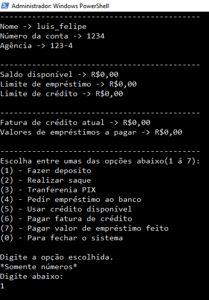

# Sistema Bancário em java ☕

## Este é um sistema bancário básico implementado com noções básicas de POO(Programação Orientada a Objeto), feito com intenção de botar em prática alguns temas de estudo que eu estou vendo.

# Execução:

### Para execultá-lo em sua máquina, siga este passos:
1. Tenha uma **JRE** instalada em sua máquina.
2. Clone o repositório ->  ``` git clone https://github.com/luisfl04/conta_bancaria-java.git ```
3. Navegue até o diretório ```"./bin"``` do projeto usando o ```cd + caminho``` em seu terminal. Ex: ``` cd /conta_bancaria-java/bin/```
4. Execute o programa usando o comando -> ```java proj.luisfl04.contaBancaria.frontend.InterfaceBanco ```
5. Após estes passos, o programa deve ser executado.

# Funcionamento:

## Tela do programa:
    

## Descrição:

### - O fluxo de funcionamento é bem simples, primeiramente é pedido algumas informações gerais para o usuário, como: nome, numero de conta e numero da agência. Essas informações são nescessárias para 'criar' a conta relacionada a este usuário. Depois disso, é mostrado uma tela de menu, onde mostra os dados relacionados ao dinheiro do usuário, estes dados vão do saldo atual, ao valor de limite de crédito que ele possui. A medida que o usuário vai interagindo com o sistema, os valores de limite de crédito e emprestimo vão aumentando. Pois foi implementada uma lógica que faz isso de acordo com a quantidade de movimentações bancárias do usuário. Os valores de depósito são infinitos, já valores negativos não são permitidos em nenhuma das implementações. Enfim, basicamente é isso que este sistema faz.

# Demais infos:

### Fique a vontade para sugerir implementações, ou algum erro que você acha que deve ser resolvido.

## Minhas redes:
[](https://www.instagram.com/luisfl04_/)


